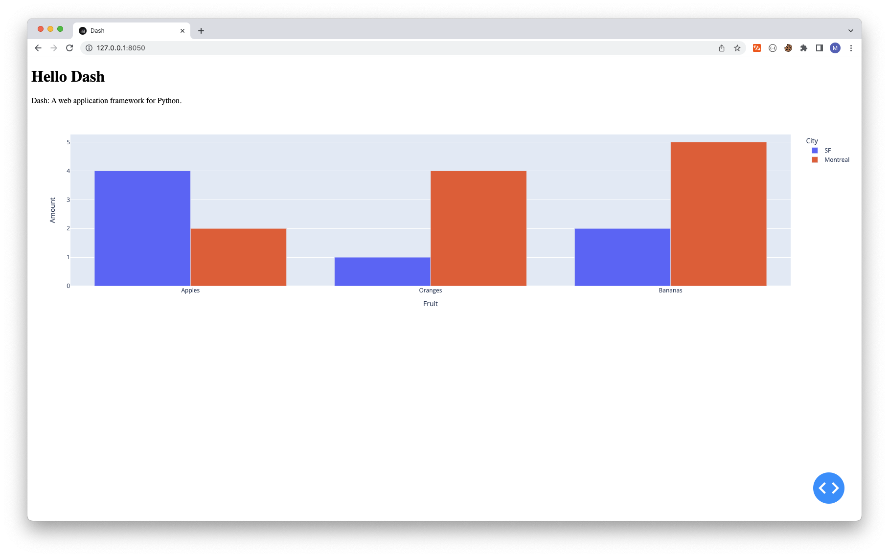
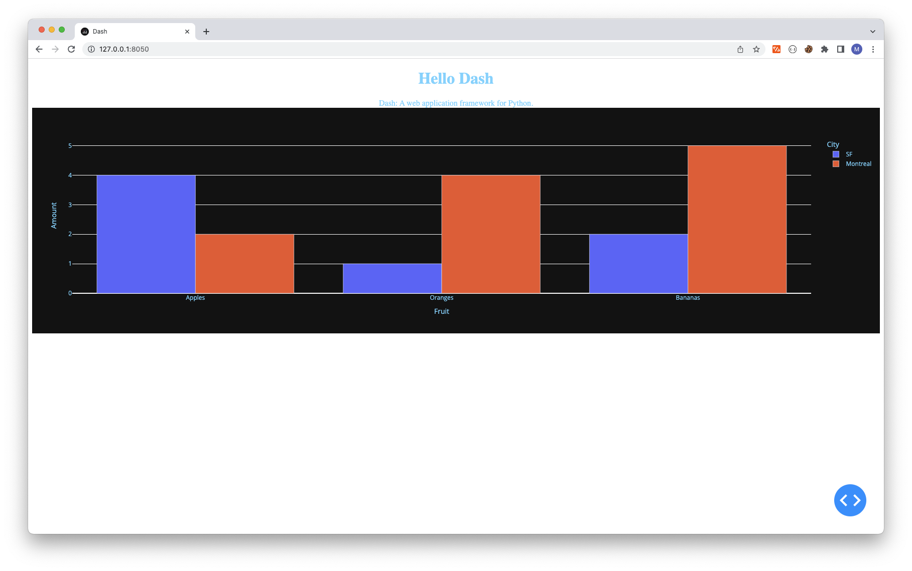
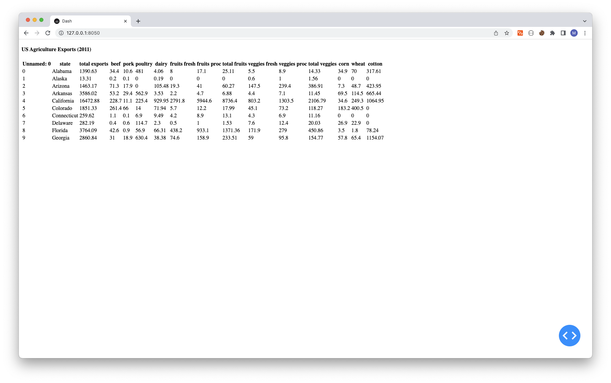
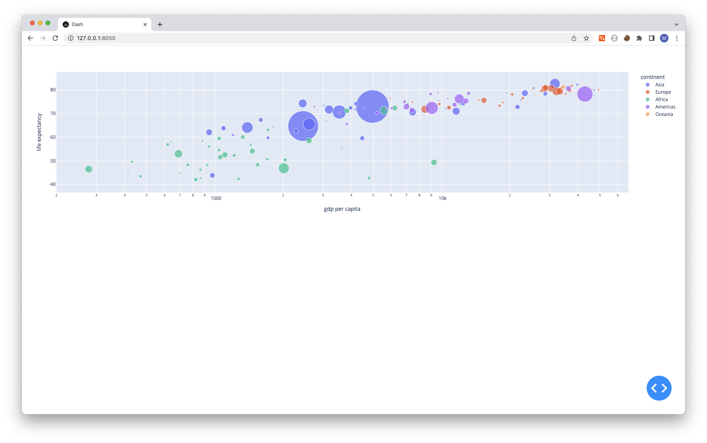
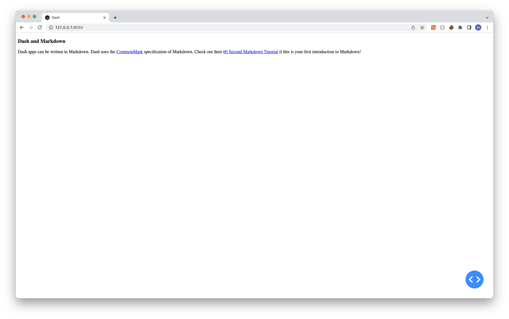
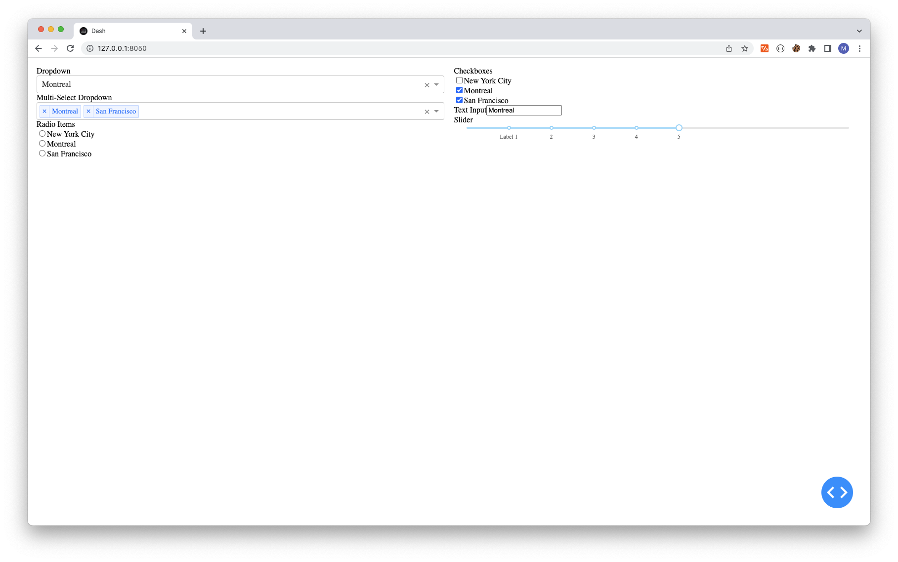
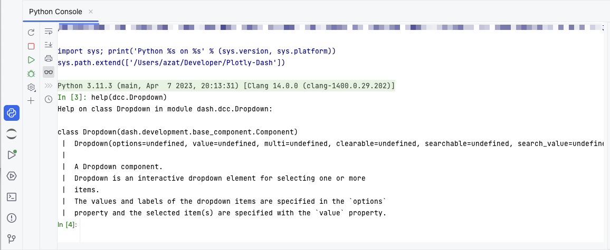

# Dash Layout

Dash apps are composed of two parts. The first part is the "`layout`", which describes **what the app looks like.** 

- structure
- style


## Hello Dash

```python
# Run this app with `python app.py` and
# visit http://127.0.0.1:8050/ in your web browser.

from dash import Dash, dcc, html
import plotly.express as px
import pandas as pd

app = Dash(__name__)

colors = {
    'background': '#111111',
    'text': '#7FDBFF'
}

# assume you have a "long-form" data frame
# see https://plotly.com/python/px-arguments/ for more options
df = pd.DataFrame({
    "Fruit": ["Apples", "Oranges", "Bananas", "Apples", "Oranges", "Bananas"],
    "Amount": [4, 1, 2, 2, 4, 5],
    "City": ["SF", "SF", "SF", "Montreal", "Montreal", "Montreal"]
})

fig = px.bar(df, x="Fruit", y="Amount", color="City", barmode="group")

fig.update_layout(
    plot_bgcolor=colors['background'],
    paper_bgcolor=colors['background'],
    font_color=colors['text']
)

app.layout = html.Div(style={'backgroundColor': colors['background']}, children=[
    html.H1(
        children='Hello Dash',
        style={
            'textAlign': 'center',
            'color': colors['text']
        }
    ),

    html.Div(children='Dash: A web application framework for your data.', style={
        'textAlign': 'center',
        'color': colors['text']
    }),

    dcc.Graph(
        id='example-graph-2',
        figure=fig
    )
])

if __name__ == '__main__':
    app.run_server(debug=True)
```



## More about HTML



## Reuseable Components

```python
def generate_table(dataframe, max_rows=10):
    return html.Table([
        html.Thead(
            html.Tr([html.Th(col) for col in dataframe.columns])
        ),
        html.Tbody([
            html.Tr([
                html.Td(dataframe.iloc[i][col]) for col in dataframe.columns
            ]) for i in range(min(len(dataframe), max_rows))
        ])
    ])
    
app.layout = html.Div([
    html.H4(children='US Agriculture Exports (2011)'),
    generate_table(df)
])
```




## More about Visualization

The Dash Core Components module (`dash.dcc`) includes a component called `Graph`.

`Graph` renders interactive data visualizations using the open source [plotly.js](https://github.com/plotly/plotly.js) JavaScript graphing library. Plotly.js supports over 35 chart types and renders charts in both vector-quality SVG and high-performance WebGL.

```python
fig = px.scatter(df, x="gdp per capita", y="life expectancy",
                 size="population", color="continent", hover_name="country",
                 log_x=True, size_max=60)

app = Dash(__name__)

app.layout = html.Div([
    dcc.Graph(figure=fig),
])
```




## Markdown 

While Dash exposes HTML through Dash HTML Components (`dash.html`), it can be tedious to write your copy in HTML. For writing blocks of text, you can use the `Markdown` component in Dash Core Components (`dash.dcc`). Create a file named `app.py` with the following code:

```python
markdown_text = '''
### Dash and Markdown

Dash apps can be written in Markdown.
Dash uses the [CommonMark](https://commonmark.org/)
specification of Markdown.
Check out their [60 Second Markdown Tutorial](https://commonmark.org/help/)
if this is your first introduction to Markdown!
'''
app = Dash(__name__)
app.layout = html.Div([
    dcc.Markdown(children=markdown_text)
])

if __name__ == '__main__':
    app.run_server(debug=True)
```




## Core Components `dash.dcc`

like dropdowns, graphs, markdown blocks, and more.

they are described entirely declaratively. Every option that is configurable is available as a keyword argument of the component.

```python
from dash import Dash, html, dcc

app = Dash(__name__)

dropdown = html.Div([
    html.Label('Dropdown'),
    dcc.Dropdown(
        options=['New York City', 'Montreal', 'San Francisco'],
        value='Montreal',
    ),
])

multi_select = html.Div([
    html.Label('Multi-Select Dropdown'),
    dcc.Dropdown(
        options=['New York City', 'Montreal', 'San Francisco'],
        value=['Montreal', 'San Francisco'],
        multi=True,
    ),
], id='multi-select')

radio = html.Div([
    html.Label('Radio Items'),
    dcc.RadioItems(
        options=['New York City', 'Montreal', 'San Francisco'],
    ),
])

checkbox = html.Div([
    html.Label('Checkboxes'),
    dcc.Checklist(
        options=['New York City', 'Montreal', 'San Francisco'],
        value=['Montreal', 'San Francisco'],
    ),
])

text_input = html.Div([
    html.Label('Text Input'),
    dcc.Input(value='Montreal', type='text'),
])

slider = html.Div([
    html.Label('Slider'),
    dcc.Slider(
        min=0,
        max=9,
        marks={i: 'Label {}'.format(i) if i == 1 else str(i) for i in range(1, 6)},
        value=5,
    ),
])

app.layout = html.Div([
    html.Div([
        dropdown,
        multi_select,
        radio,
    ], style={
        'padding': '10px',
        'flex': 1,
    }),
    html.Div([
        checkbox,
        text_input,
        slider,
    ], style={
        'padding': '10px',
        'flex': 1,
    }),
], style={'display': 'flex', 'flex-direction': 'row'})

if __name__ == '__main__':
    app.run_server(debug=True)

```




### Help

```python
>>> help(dcc.Dropdown)
class Dropdown(dash.development.base_component.Component)
|  A Dropdown component.
|  Dropdown is an interactive dropdown element for selecting one or more
|  items.
|  The values and labels of the dropdown items are specified in the `options`
|  property and the selected item(s) are specified with the `value` property.
|
|  Use a dropdown when you have many options (more than 5) or when you are
|  constrained for space. Otherwise, you can use RadioItems or a Checklist,
|  which have the benefit of showing the users all of the items at once.
|
|  Keyword arguments:
|  - id (string; optional)
|  - className (string; optional)
|  - disabled (boolean; optional): If true, the option is disabled
|  - multi (boolean; optional): If true, the user can select multiple values
|  - options (list; optional)
|  - placeholder (string; optional): The grey, default text shown when no option is selected
|  - value (string | list; optional): The value of the input. If `multi` is false (the default)
|  then value is just a string that corresponds to the values
|  provided in the `options` property. If `multi` is true, then
|  multiple values can be selected at once, and `value` is an
|  array of items with values corresponding to those in the
|  `options` prop.
```

